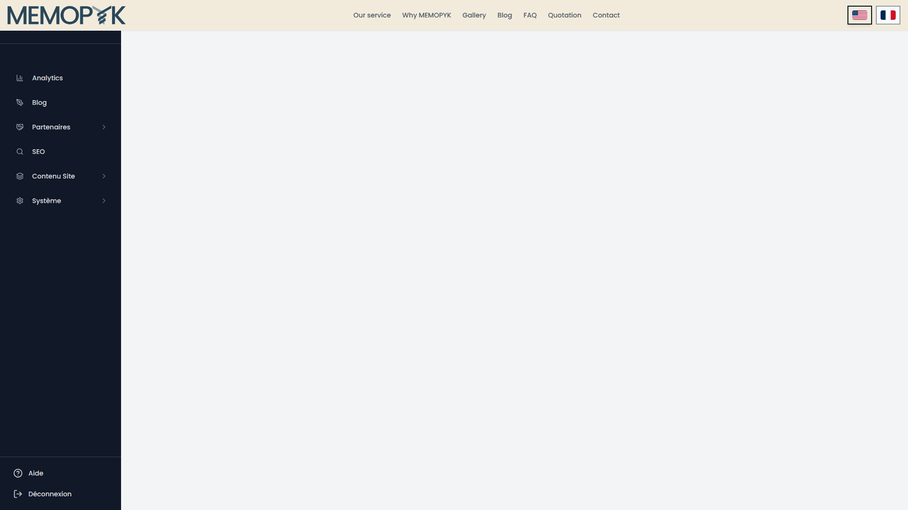
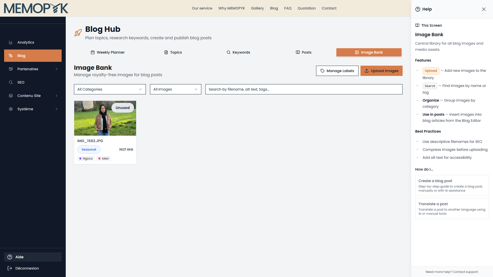
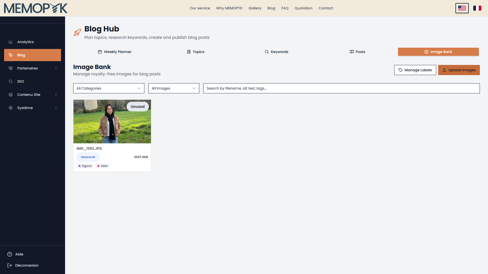
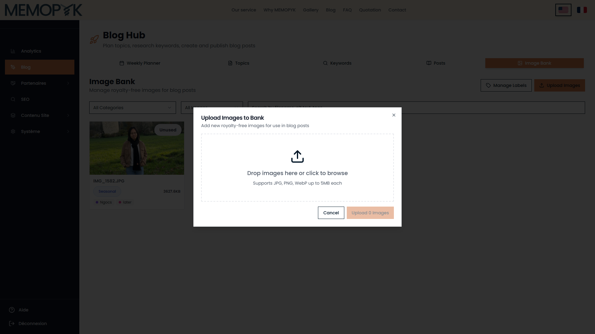
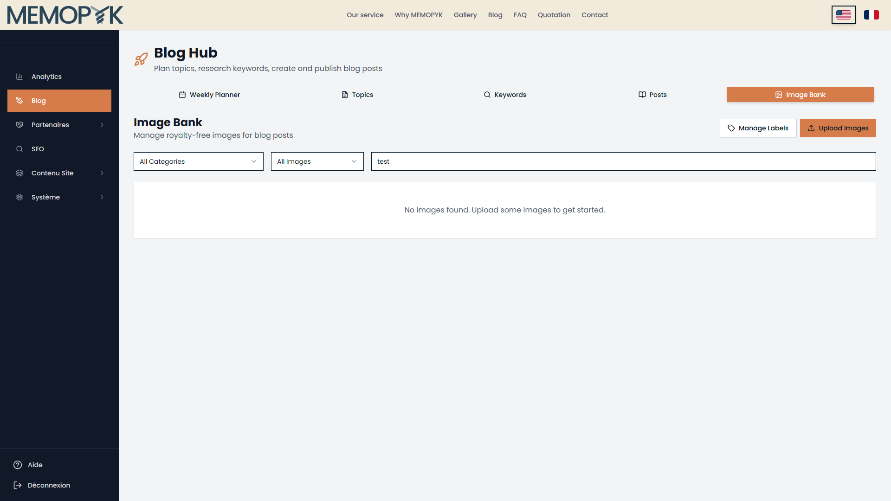
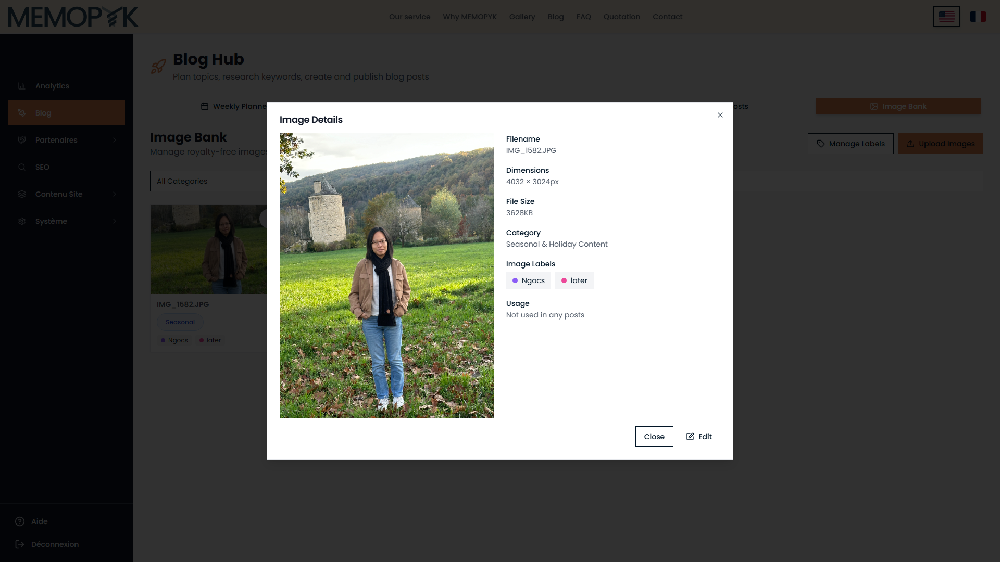
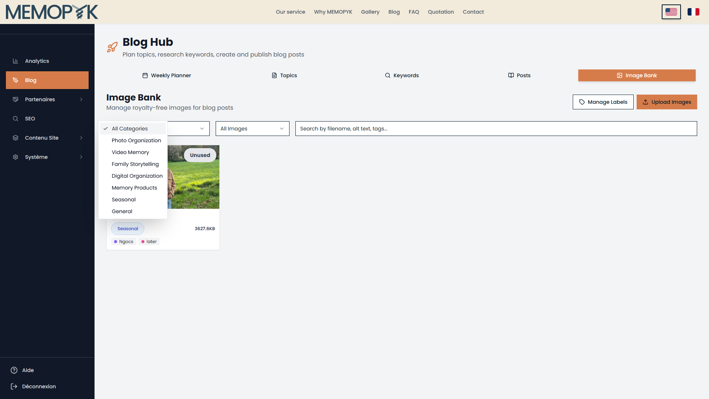

# Naive User Test Report — Image Bank Screen (V3)

**Test Date:** 05/02/2026 08:45:37
**Environment:** https://memopyk.memopyk.com
**Screen Tested:** Image Bank
**Version:** V2 (Fixed help content timing)

---

## Summary

| Rating | Count |
|--------|-------|
| CLEAR | 14 |
| AMBIGUOUS | 0 |
| BLOCKED | 1 |
| **Total** | **15** |

### Overall Assessment

✅ **PASS** — 93% of items rated CLEAR. Image Bank is usable.

---

## Phase Results

### Route Discovery

| Item | Rating | Notes |
|------|--------|-------|
| Direct URL: /admin?tab=images | ✅ CLEAR | Direct URL loads Image Bank with working help |
| Direct URL: /admin?tab=image-bank | ❌ BLOCKED | Route does NOT load Image Bank - invalid tab name |
| Proper Navigation: Sidebar → Blog → Image Bank tab | ✅ CLEAR | Proper navigation works - this is how users should access Image Bank |

**Phase Summary:** 2 CLEAR, 0 AMBIGUOUS, 1 BLOCKED

#### Direct URL: /admin?tab=images


#### Direct URL: /admin?tab=image-bank



#### Proper Navigation: Sidebar → Blog → Image Bank tab


---

### Help Panel Content

| Item | Rating | Notes |
|------|--------|-------|
| Help Panel Opened | ✅ CLEAR | Help panel opens successfully |
| Help Content Quality | ✅ CLEAR | Help clearly explains Image Bank purpose and features |
| Help Sections Coverage | ✅ CLEAR | Help includes: Features ✓ Best Practices ✓ |

**Phase Summary:** 3 CLEAR, 0 AMBIGUOUS, 0 BLOCKED

#### Help Panel Opened



---

### UI Verification

| Item | Rating | Notes |
|------|--------|-------|
| Upload Button | ✅ CLEAR | Upload button found: "Upload Images" |
| Manage Labels Button | ✅ CLEAR | Labels button found: "Manage Labels" |
| Category Filter | ✅ CLEAR | Category filter is present |
| Search Input | ✅ CLEAR | Search input is present |
| Image Cards/Grid | ✅ CLEAR | 1 images displayed in grid |

**Phase Summary:** 5 CLEAR, 0 AMBIGUOUS, 0 BLOCKED

#### Upload Button



#### Manage Labels Button


#### Category Filter


#### Search Input


#### Image Cards/Grid


---

### Naive User Actions

| Item | Rating | Notes |
|------|--------|-------|
| Upload Image Action | ✅ CLEAR | Upload modal shows clear instructions: "Drop images here or click to browseSupports JPG, PNG, WebP up to 5MB each" |
| Search Images Action | ✅ CLEAR | Search filtered results |
| View Image Details | ✅ CLEAR | Image details modal opened on click |
| Category Filter Action | ✅ CLEAR | Filter dropdown shows 8 options |

**Phase Summary:** 4 CLEAR, 0 AMBIGUOUS, 0 BLOCKED

#### Upload Image Action




#### Search Images Action



#### View Image Details



#### Category Filter Action



---

## Help Content Extracted

```
Help
This Screen
Image Bank

Central library for all blog images and media assets.

Features
Upload — Add new images to the library
Search — Find images by name or tag
Organize — Group images by category
Use in posts — Insert images into blog articles from the Blog Editor
Best Practices
Use descriptive filenames for SEO
Compress images before uploading
Add alt text for accessibility
How do I...

Create a blog post

Step-by-step guide to create a blog post, manually or with AI assistance

Translate a post

Translate a post to another language using AI or manual tools

Need more help? Contact support.
```

## Recommendations

1. [CRITICAL] Route Discovery → Direct URL: /admin?tab=image-bank: Route does NOT load Image Bank - invalid tab name

---

*Generated by naive-user-image-bank-test.ts (V3)*
