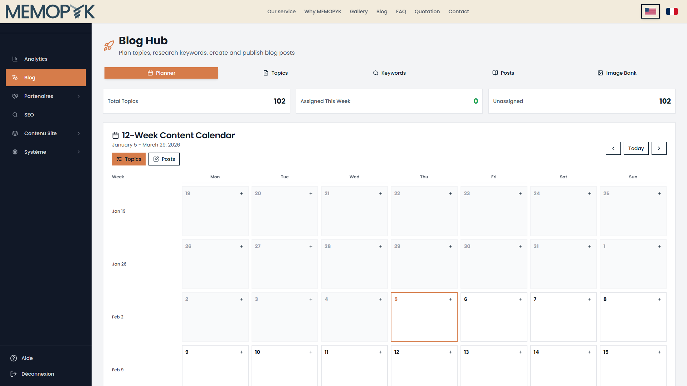
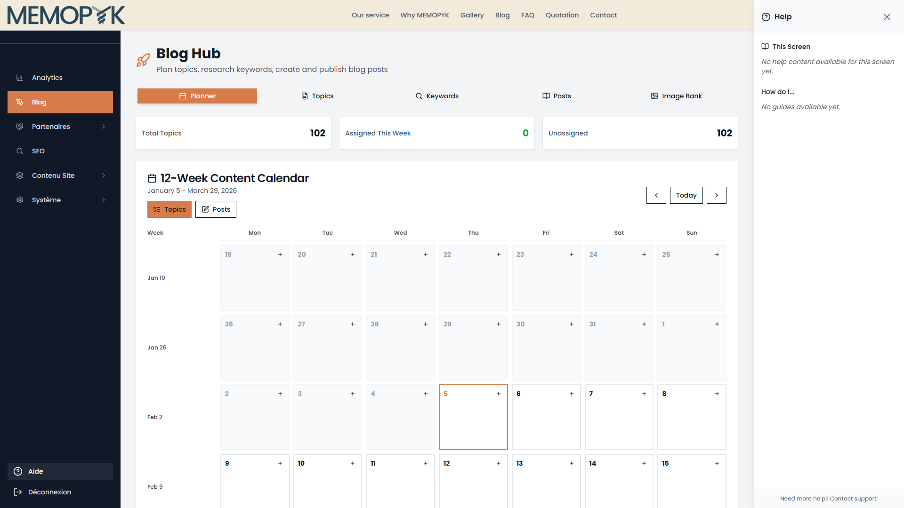
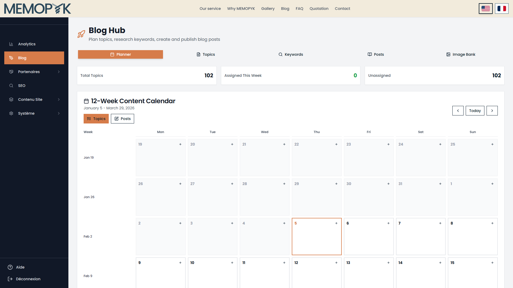
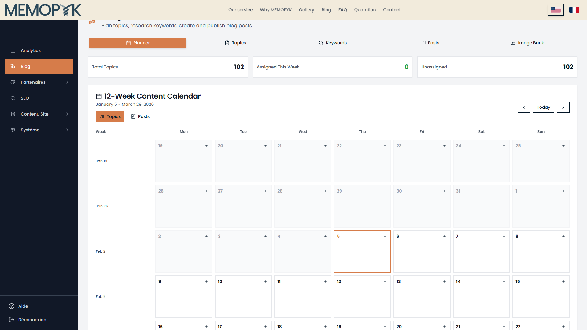
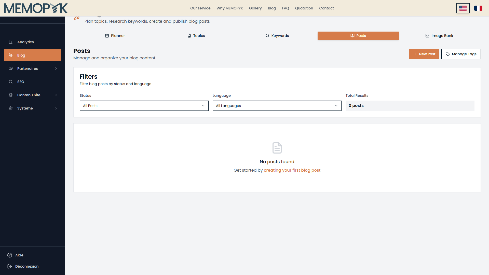
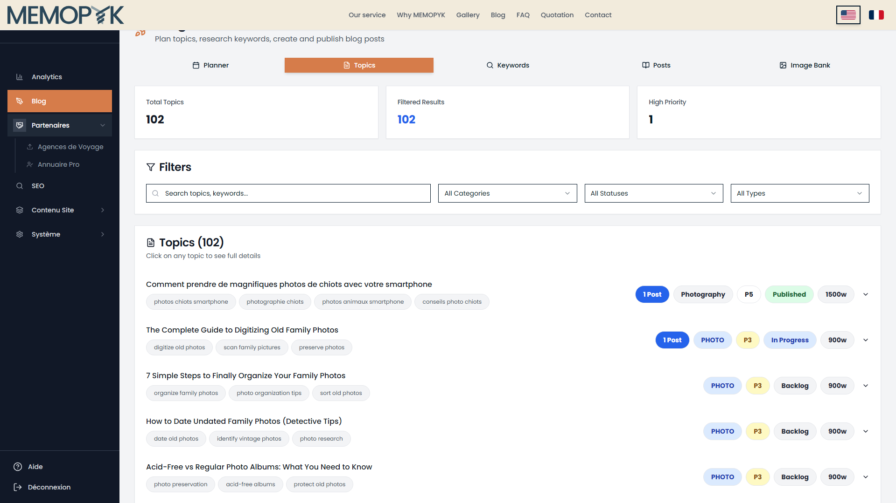

# Naive User Test Report — Planner Screen (V2)

**Test Date:** 05/02/2026 10:35:14
**Environment:** https://memopyk.memopyk.com
**Screen Tested:** Planner
**Version:** V2 (Realistic user workflow)

---

## Summary

| Rating | Count |
|--------|-------|
| CLEAR | 9 |
| AMBIGUOUS | 2 |
| BLOCKED | 5 |
| **Total** | **16** |

### Overall Assessment

⚠️ **NEEDS IMPROVEMENT** — 56% of items rated CLEAR. Some confusion expected.

---

## Phase Results

### Route Discovery

| Item | Rating | Notes |
|------|--------|-------|
| Direct URL: /admin?tab=planner | ✅ CLEAR | Direct URL loads Planner with working help |
| Sidebar Navigation: Blog → Planner | ✅ CLEAR | Sidebar navigation works - Planner accessible via Blog Hub |
| Blog Default Tab | ✅ CLEAR | Planner is the default tab when clicking Blog |

**Phase Summary:** 3 CLEAR, 0 AMBIGUOUS, 0 BLOCKED

#### Direct URL: /admin?tab=planner



#### Sidebar Navigation: Blog → Planner


#### Blog Default Tab


---

### Help Panel Content

| Item | Rating | Notes |
|------|--------|-------|
| Help Panel Opened | ✅ CLEAR | Help panel opens successfully |
| Help Content Quality | ❌ BLOCKED | No meaningful help content |

**Phase Summary:** 1 CLEAR, 0 AMBIGUOUS, 1 BLOCKED

#### Help Panel Opened



---

### UI Verification

| Item | Rating | Notes |
|------|--------|-------|
| View Toggle (Topics/Posts) | ✅ CLEAR | Both view toggles found |
| Week Navigation | ✅ CLEAR | Today button found for week navigation |
| Calendar Grid | ❌ BLOCKED | Calendar grid not found |
| Add Topic Buttons (+) | ❌ BLOCKED | No + buttons visible - cannot add topics |
| Day Column Headers | ⚠️ AMBIGUOUS | Day headers not clearly visible |

**Phase Summary:** 2 CLEAR, 1 AMBIGUOUS, 2 BLOCKED

#### View Toggle (Topics/Posts)



#### Week Navigation


#### Calendar Grid


#### Add Topic Buttons (+)


#### Day Column Headers


---

### Naive User Actions

| Item | Rating | Notes |
|------|--------|-------|
| Step 1: Read Help Instructions | ⚠️ AMBIGUOUS | Help does not clearly explain what actions to take |
| Step 2: Click + to Assign Topic | ❌ BLOCKED | Cannot assign topic - + button not visible on any day cell |
| Step 5: View Card with Actions | ✅ CLEAR | Card shows 1 action icons on hover |
| Step 6: Switch to Posts View | ✅ CLEAR | Posts view shows published/scheduled posts |
| Step 7: Click Today Button | ❌ BLOCKED | Cannot navigate to today - button not visible |
| Step 8: Navigate Weeks | ✅ CLEAR | Week navigation arrows work |

**Phase Summary:** 3 CLEAR, 1 AMBIGUOUS, 2 BLOCKED

#### Step 1: Read Help Instructions


#### Step 5: View Card with Actions




#### Step 6: Switch to Posts View



#### Step 8: Navigate Weeks



---

## Help Content Extracted

```
Help
This Screen

No help content available for this screen yet.

How do I...

No guides available yet.

Need more help? Contact support.
```

## Recommendations

1. [CRITICAL] Help panel shows "No help content" - route detection issue
2. [CRITICAL] Help Panel Content → Help Content Quality: No meaningful help content
3. [CRITICAL] UI Verification → Calendar Grid: Calendar grid not found
4. [CRITICAL] UI Verification → Add Topic Buttons (+): No + buttons visible - cannot add topics
5. [IMPROVE] UI Verification → Day Column Headers: Day headers not clearly visible
6. [IMPROVE] Naive User Actions → Step 1: Read Help Instructions: Help does not clearly explain what actions to take
7. [CRITICAL] Naive User Actions → Step 2: Click + to Assign Topic: Cannot assign topic - + button not visible on any day cell
8. [CRITICAL] Naive User Actions → Step 7: Click Today Button: Cannot navigate to today - button not visible

---

*Generated by naive-user-planner-test.ts (V2)*
