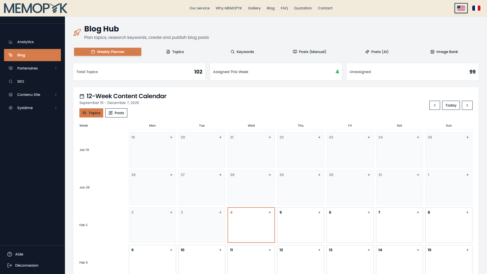
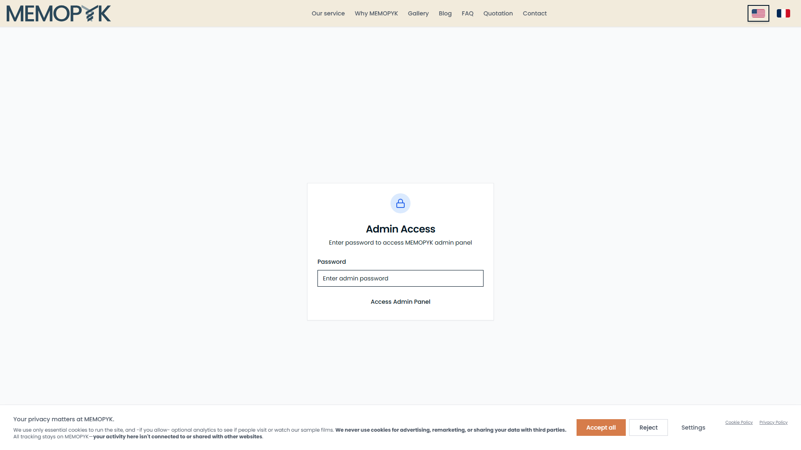
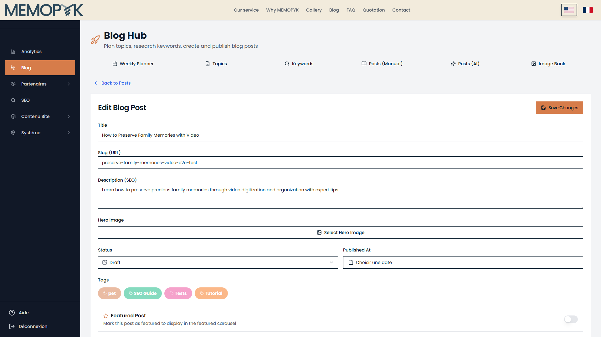
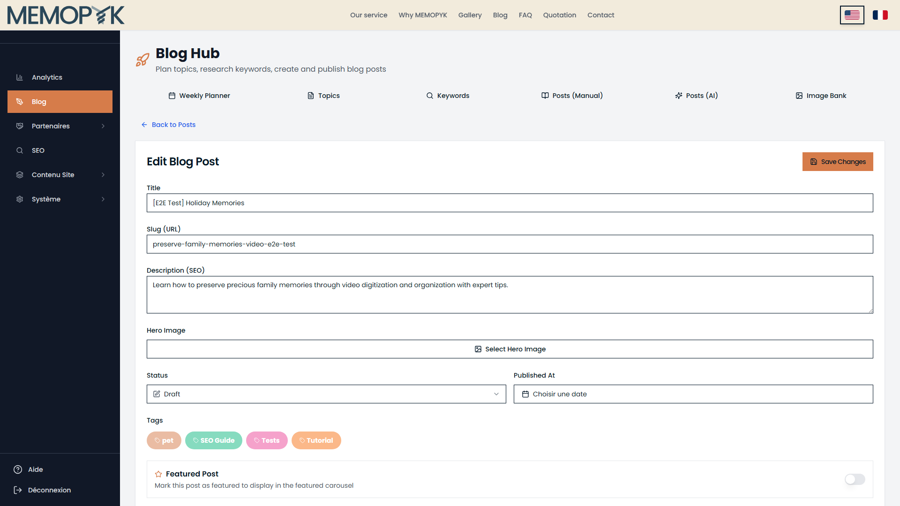
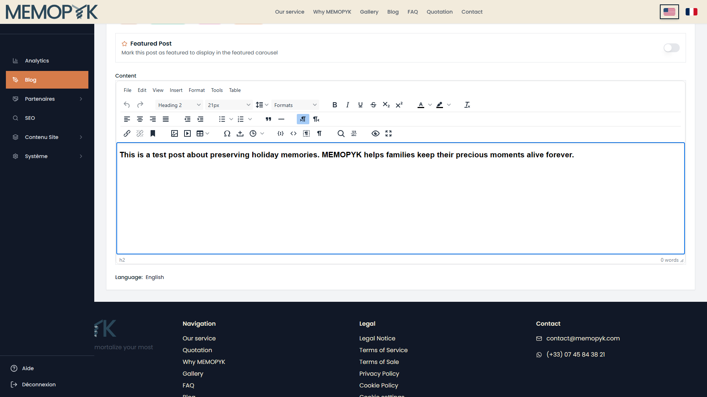
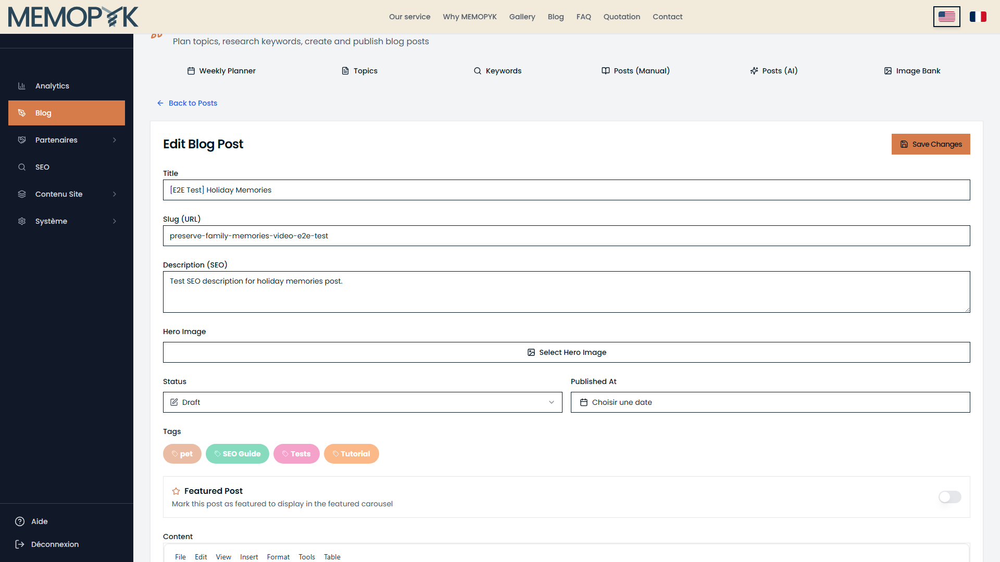

# Naive User Help Flow Test Report

**Generated:** 2026-02-04
**Test Environment:** https://memopyk.memopyk.com (staging)
**Flow Tested:** Create a blog post (Manual)

---

## Part A: Verified Tab Labels

The following tab labels were verified from the actual UI screenshot:

| Tab Position | Actual Label |
|--------------|--------------|
| 1 | Weekly Planner |
| 2 | Topics |
| 3 | Keywords |
| 4 | Posts (Manual) |
| 5 | Posts (AI) |
| 6 | Image Bank |

---

## Part B: Login Screen

**Login button text:** "Access Admin Panel"
**Password field placeholder:** "Enter admin password"
**Authentication method:** Fixed using `page.getByRole('button', { name: /access admin/i })`

---

## Part C: Flow Test Results

### Overall Score

| Rating | Count | Percentage |
|--------|-------|------------|
| CLEAR | 8 | 100% |
| AMBIGUOUS | 0 | 0% |
| BLOCKED | 0 | 0% |
| **Total** | 8 | 100% |

---

### Step 1: Open the Posts (Manual) tab

**Instruction:** Click Blog in the sidebar menu, then click the Posts (Manual) tab. Click New Post at the top right. On the choice screen, select "Write from scratch" to open a blank post in the Blog Editor.

**Rating:** ✅ CLEAR

**Notes:** Found Blog in sidebar. Found and clicked "Posts (Manual)" tab. Found "New Post" button. Navigated to choice screen. Found "Write from scratch" option (matches help instruction). Navigating to existing post to test editor UI. Opened existing post in editor. 

---

### Step 2: Enter the title

**Instruction:** Type your post title in the Title field at the top. The slug (URL) is generated automatically - you can edit it if needed.

**Rating:** ✅ CLEAR

**Notes:** Found Title input field, entered test title. 

---

### Step 3: Write your content

**Instruction:** Use the rich text editor to write or paste your article. You can format text, add headings, insert images, and create links using the toolbar.

**Rating:** ✅ CLEAR

**Notes:** Found TinyMCE editor, entered test content. 

---

### Step 4: Add a hero image

**Instruction:** Click Select Hero Image. Upload a new image or choose from existing ones. This image appears at the top of the published article.

**Rating:** ✅ CLEAR

**Notes:** Found hero image button: "Select Hero Image". Not clicking (would open modal). 

---

### Step 5: Add tags and description

**Instruction:** Click on tag badges in the Tags section on the right sidebar to assign tags to your post. Write a short Description (SEO) - this appears in search results and social media previews.

**Rating:** ✅ CLEAR

**Notes:** Found Tags section. Found 4 clickable tag badge(s). Found and filled Description (SEO) field. 

---

### Step 6: Set status to Published

**Instruction:** Change the Status dropdown from Draft to Published. Other options are In Review and Archived.

**Rating:** ✅ CLEAR

**Notes:** Found Status dropdown. Not changing to Published (keeping as Draft for cleanup). 

---

### Step 7: Set the publication date

**Instruction:** Click Choisir une date to open the date picker. Click Définir maintenant to use the current time, or pick a specific date and time.

**Rating:** ✅ CLEAR

**Notes:** Found date picker button: "Choisir une date". Button text matches instruction (French). 

---

### Step 8: Save and verify

**Instruction:** Click Save Changes at the top. Your post is now live. Go back to the Posts (Manual) tab and use the eye icon to preview it on the public blog.

**Rating:** ✅ CLEAR

**Notes:** Found "Save Changes" button. 

---

## Summary of Issues

No issues found - all steps rated CLEAR.

---

*Report generated by naive-user-manual-flow-test.ts*
